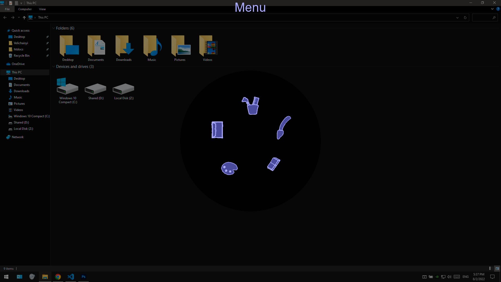

# Sraw
platform: Windows
## build outputs stored in folder ./bin (portable folder)
>Open

to open press lctrl + lwin
>Menu

>Hide
window is hidden 
* when the focus is lost 
* when the window appears on top 
* when the ESC key is pressed 
* when selected Menu/Quit/Hide canvas

>Quit
to quit application select: 
* Menu/Quit/Quit application

menu opens using rclick on Sraw window independently of opened tool

> Menu/Brush

> Menu/Eraser

> Menu/Palete

> Menu/Tools/Block diagram/

> Menu/Tools/Selection

> Menu/Quit/Save to file

> Menu/Quit/Copy to clipboard

> Menu/Quit/Hide canvas

> Menu/Quit/Clear canvas

> Menu/Quit/Quit application
