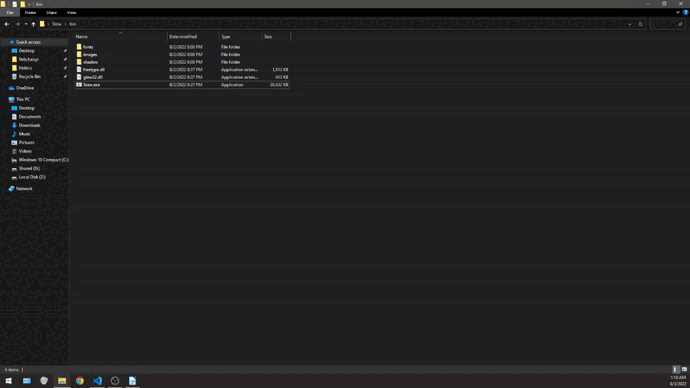

# Sraw
- platform: Windows
- build outputs stored in folder ./bin (portable folder)
## Open
- to open press lctrl + lwin
## Menu
- menu opens using rclick on Sraw window independently of opened tool

## Hide
- window is hidden: 
    - when the focus is lost 
    - when the window appears on top 
    - when the ESC key is pressed 
    - when selected Menu/Quit/Hide canvas

## Quit
- to quit application select: 
    - Menu/Quit/Quit application

## Menu/Brush
- ']}' To increase size
- '[{' To reduce size
- scroll up to reduce size
- scroll down to increase size
- ''"' To increase smooth
- ';:' To reduce smooth

## Menu/Eraser
- ']}' To increase size
- '[{' To reduce size
- scroll up to reduce size
- scroll down to increase size

## Menu/Palete
- changes color for each tool, that requires color

## Menu/Tools/Block diagram/
- scroll up to reduce size
- scroll down to increase size

## Menu/Tools/Primitives/-
- ']}' To increase size
- '[{' To reduce size
- scroll up to reduce size
- scroll down to increase size
- ''"' To increase smooth
- ';:' To reduce smooth
- alt to keep primitive in center

## Menu/Tools/Selection
- scroll up to reduce size
- scroll down to increase size

- scroll up to reduce size of moving region
- scroll down to increase size of moving region
- delete to clear region
- move with control to copy contents instead of cutting

## Menu/Quit/Save to file

## Menu/Quit/Copy to clipboard

## Menu/Quit/Hide canvas

## Menu/Quit/Clear canvas

## Menu/Quit/Quit application
